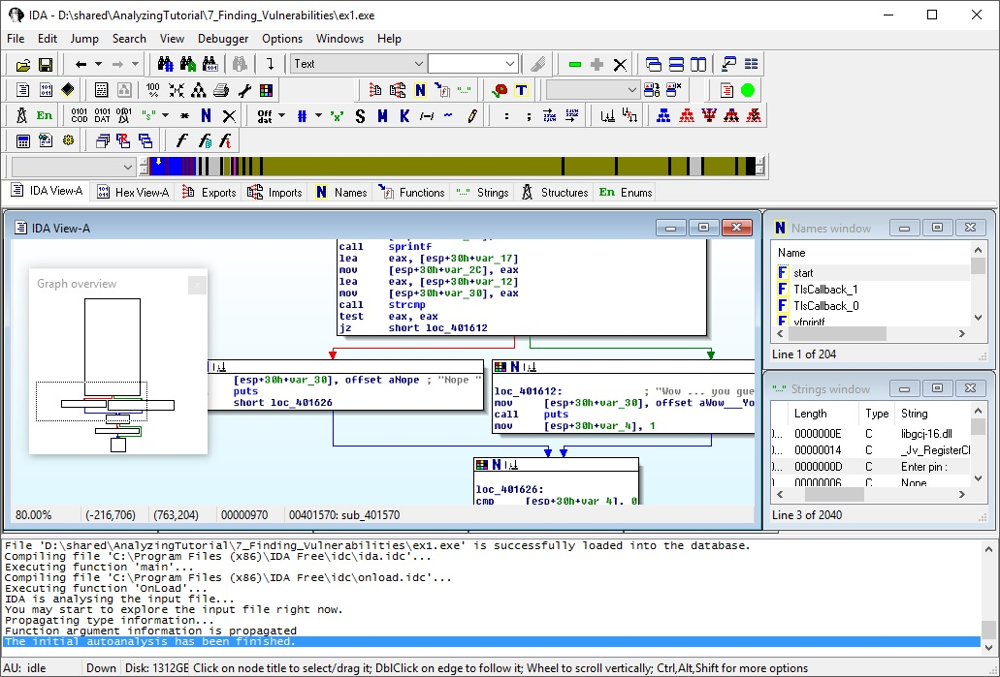

IDA Pro Interface
=================

IDA Pro has a graphical interface, which makes it very comfortable to work with. 

There are different windows for:
- Disassembly
- Hexcode
- Exports
- Imports
- Names
- Functions
- Strings
- etc...

Commands can be given with menu/right-click or with keyboard-shortcuts. 
