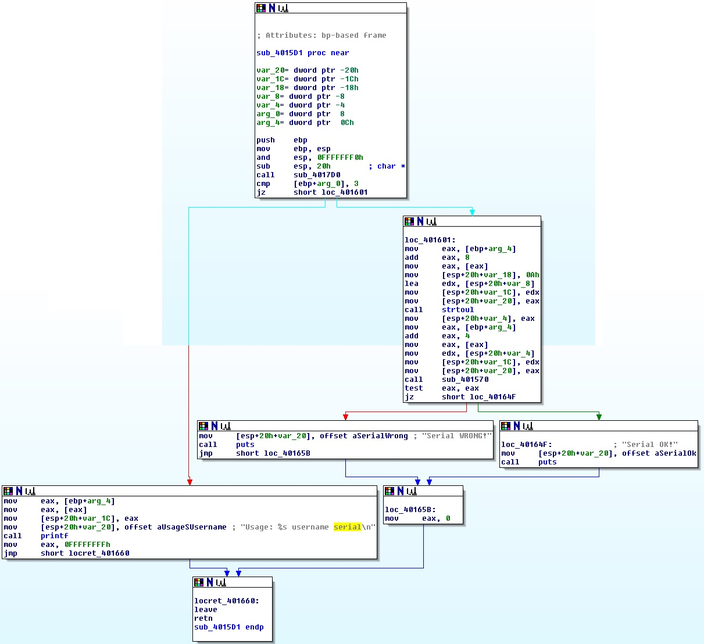
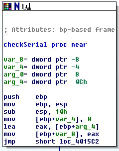
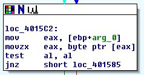
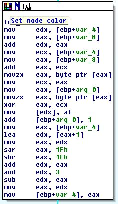
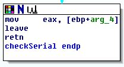
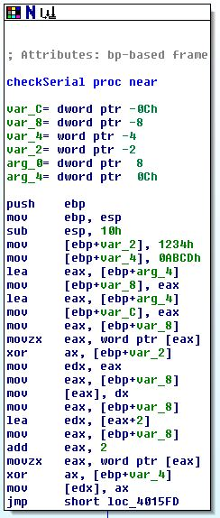
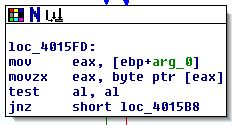
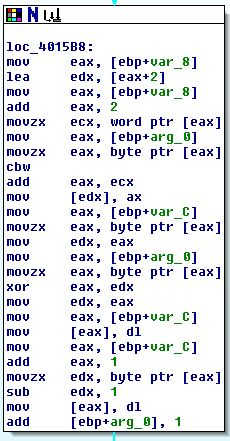
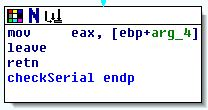

Solutions for IDA Pro
=====================

To find out how the serial is checked, and how to generate our own serial we will use a combination of debugging and step-by-step reconstruction of the code. 

The concept of the reverse-engineering of these 3 exercises is basically the same:
- First, we will try to find out how and where the serial is verified
- Then, we will try to rebuild the function and verify it by using the same input in our function and the debugger and compare the result
- At last, we 'reverse' the verification to generate a valid serial and test it

_Note: Because the main-program is the same for each of the 2 exercises, it is only analyzed an explained in the first one._

Exercise 1
----------



What do we have here:
- Check, if there are 2 arguments
- Conversion of `argv[2]` to an unsignedlong-value and store it in `var_4`
- Call the `sub_401570` function with parameters `argv[1]` and `var_4`
- Depending on the result we display if the serial is right or wrong

So, we could theoretically change the conditional jump to display the "Serial OK!" message even if the serial is invalid, but we want to make a serial generator here.

It also seems, that we cannot 'sniff' a valid serial here, we take a look at  `sub_401570`


So this looks very promising. There are no additional calls to other functions, only some calculations based on the username (`arg_0`) and serial (`arg_4`) are made. The function returns the value in the password-variable, and since we know that this value has to be 0 to succeed, we must try to figure out what happens there.

We also have 2 local variables, so we could now try to figure out what they are doing. But since we have a very small program here, we skip this and try to convert the program block-wise to pseudo c-code.



```
var_4 = 0
var_8 = arg_2
goto test	
```



Here we have the test for the loop.
```
test:
if(arg_0 != 0)
	goto start
```



Here the `var_4`th byte of the serial(`var_8`) is loaded and XORed with a part of the username (`arg_0`). this also gives us a hint why the address of the serial (`arg_4`) is stored in a local variable (`var_8`) -> this may be because the serial is `unsigned long` and the serial may be `unsigned char` for easier indexing.

```
start:
var_8[var_4] = var_8[var_4] ^ *arg_0 ; 1 byte
```

This part may be a little confusing, but it is in fact a optimized version of a simple modulo operation of a signed integer. The only interesting part here is the and-operator, the rest is for preserving the sign.

```
arg_0++
var_4 = (var_4+1)%4
```



```
return arg_4
```

With this information, we can reconstruct a c-program of the verification:
```
int checkSerial(char *name, unsigned long serial)
{
	int var_4 = 0;
	unsigned char *var_8 = (unsigned car*)&serial;
	goto test;
start:
	var_8[var_4] = var_8[var_4] ^ *name ;
	name++;
	var_4 = (var_4+1)%4;
test:
	if(name != 0)
		goto start;
	
	return serial;
	}
```

We could now rename the local variables and restructure it, but when we look at the function, we see that the given serial is only XORed with the username ... so basically, when we input 0 as the serial, we would get the right serial number as the return value.

So we set the breakpoint after the `checkSerial` function and start the program with parameter 0. The return-value of the function should be the serial.

Now let's test it (`ex1 user 1919251317`)

```
Serial OK!
```

Exercise 2
----------

Finding the functions:

`sub_40160C` = `main`

`sub_401570` = `checkSerial`

Since the main-function is basically the same as in exercise 1, we could just simply try to input 0 as serial again and grab the return value of `checkSerial` as our serialnumber.

```
ex1 user 2911637029

Serial WRONG!
```

Ok, that would have been a little bit too easy ... so we have to take a look at `checkSerial` again:


We see from the listing, that there are 2 more variables compared to the last exercise. But at first, let's start with the block-wise analyzation.


This is the initialization of the variables. Since the operations on arg_4 are of the size word, we assume that the type is unsigned short
```
unsigned short word1 = 0x1234;
unsigned short word2 = 0xabcd;
unsigned short *var_8 = (unsigned short*) &serial;
var_C = &serial;

var_8[0] = var_8[0]^word1; // 0x08048469 - 0x08048478
var_8[1] = var_8[1]^word2; // 0x0804847b - 0x0804848e

goto test;
```


This is our loop-condition again
```
test:

if(*username!=0)
	goto loop;
```


Here is the serial verification algorithm, we can also assume, that var_C is an `unsigned char` pointer to serial
```
loop:
var_8[1] = var_8[1] + *username;
var_C[0] = var_C[0] ^ *username;
var_C[1]--;
username++;
```



And here we return the serial number.
```
return serial;
```

So the checkSerial function is something like:
```
unsigned long checkSerial(char *username, unsigned long serial)
{
	unsigned short word1 = 0x1234;
	unsigned short word2 = 0xabcd;
	unsigned short *var_8 = (unsigned short*) &serial;
	unsigned char *var_C = (unsigned char *) &serial;

	var_8[0] = var_8[0]^word1;
	var_8[1] = var_8[1]^word2;

	goto test;

loop:
	var_8[1] = var_8[1] + *username;
	var_C[0] = var_C[0] ^ *username;
	var_C[1]--;
	username++;

test:

	if(*username!=0)
		goto loop;

	return serial;
}
```

A serial-generator would look like:
```
unsigned long generateSerial(char *username)
{
	unsigned long serial=0;
	unsigned short word1 = 0x1234;
	unsigned short word2 = 0xabcd;
	unsigned short *var_8 = (unsigned short*) &serial;
	unsigned char *var_C = (unsigned char *) &serial;	

	char *u=username;
	while(*username) username++;

goto test;
loop:
	username--;
	var_C[1]++;
	var_C[0] = var_C[0] ^ *username;
	var_8[1] = var_8[1] - *username;

test:happends 
	if(username!=u)
		goto loop;

	var_8[0] = var_8[0]^word1;
	var_8[1] = var_8[1]^word2;
	return serial;
}

```

Using this function, we can generate a serial and test it:
```
ex2 user 1435244069
Serial OK!
```