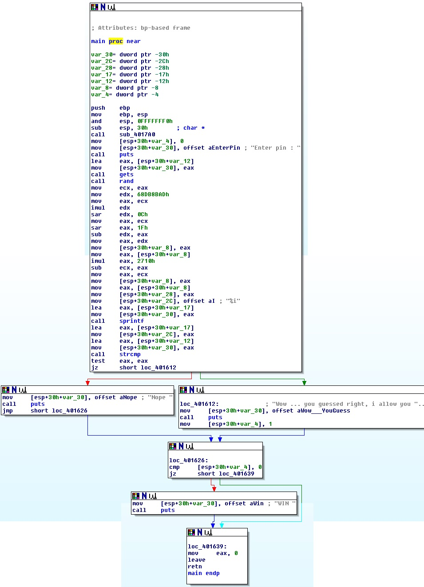

Solutions for Radare2
=====================

Each of these exercises contains a common vulnerability, which can be exploited. There are also other solutions to solve the exercises, but we only mention them and concentrate on the unsafe functions used.

_Note: these exercises could also be solved very easily be brute-forcing the input. But it is sometimes much more clear what is going on when we use a binary analyzation tool for this (especially for more complex binaries)._

Exercise 1
----------

Let's take a look at the main-function:



The goal of this exercises is that we get the 'WIN' message displayed. The conditional jump for this `printf` is done when `var_4` is not `0`, else the programs exit without printing the message.

What else happens in this function?

- First, we have some initialization
- Then the user has to input a pin
- Next, a random number is generated in converted to a string
- And finally, the pin, which the user entered, is compared to the generated pin and if it is right, `var_4` is set to `1`

So basically, we have a 1/10000 chance to guess the string.

Now let's think about what we can do now:
1. initialize `var_4` to 1
2. alter the conditional jump to display 'WIN' if we are false (or replace it with a 'NOP' to remove it)
3. the random generator is not initialized, so the number is always the same -> we could sniff it
4. perhaps there are some unsafe functions used
Since point 1-3 are trivial to do, we concentrate on point 4.

When checking the functions used, we see that `gets` is an unsafe function, because the buffer size is not checked (-> buffer overflow).

To find out if we can use this we have to take a look at the local variables:
```
var_30= dword ptr -30h
var_2C= dword ptr -2Ch
var_28= dword ptr -28h
var_17= dword ptr -17h
var_12= dword ptr -12h
var_8= dword ptr -8
var_4= dword ptr -4

```

The interesting local variables for us are the buffer (`var_12`) and the 'token' to pass (`var_4`). Since we need to overwrite parts of `var_4`, we have to write at least 15 (10 for the buffer size and 4 because of var_8) characters to the buffer.

Let's test this:
```
ex1
Enter pin : 
12345678901234
Nope 

ex1
Enter pin : 
123456789012345
Nope 
WIN 
```


Exercise 2
----------

There is no solution for exercise 2 yet, but it should be possible to break it with some format-string exploitation, which is explained [here](https://www.exploit-db.com/docs/28476.pdf)